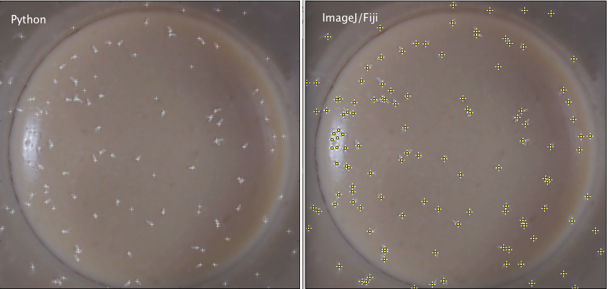

# Maxima finding algorithm recreated from implementation in ImageJ/Fiji
The first stage in the maxima finding algorithm is to find the local maxima. In many find maxima implementations this step is performed first and simply represents the identification of the maximum pixel in each 3x3 neighbourhood (in the default case). Once all the local maxima are found, the goal is then to merge and prune this maxima using some kind of measure of quality. In the case of algorithm a single parameter is used, the noise tolerance. If a maxima is close to another then the maxima will be merged or removed based on the following critera. Starting with the most bright maxima and working down the intensities:
* Scan the neighbourhood and determine whether there are any peaks which are higher. If there are, skip this maxima.
* If there are pixels in the neighbourhood within a noise tolerance of the maxima, add them to the list to be scanned, spreading out like a flood fill algorithm, until the neighbourhood is exhausted
    * If the pixels are equal to the maxima, mark this maxima as equal. 
    * If the pixels are less than maxima but greater than maxima minus the noise tolerance, mark as listed.
* Mark all pixels considered as 'processed' as long as they are included within a valid peak region. Reset all others.
* From the regions containing a peak, calculate the best pixel to be considered as maxima based on minimum distance calculation with all those considered equal.

In this repository there are two different implementations of the algorithm:  
* find_maxima.ipynb - pure Python version of the code (slow).  
* find_maxima_cython.ipynb - Python and Cython version of the code (super fast) which requires compilation.  

To build the cython version of the code (recommended). Please naviagate to the cython_findmaxima directory and run:  
    python setup.py build-ext --inplace  This will install the package locally (recommended).
    To install into your Python's site-packages directory:
    python setup.py install

This implementation doesn't yet support exclusion of edge maxima or all the varied outputs available for the ImageJ/Fiji Maxima plugin.

Comparison of Python and Fiji implementation using image 002eggs.png
